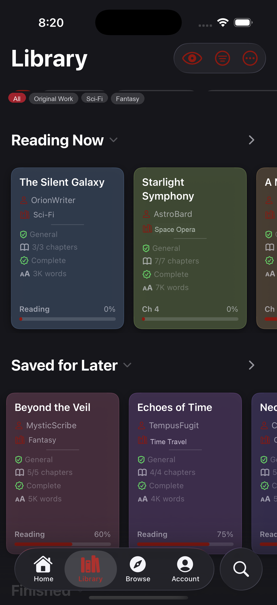

# Kudos — Open-Source AO3 Reader for iPhone, iPad, and Mac

Kudos is an open-source **AO3 reader** for **iPhone**, **iPad**, and **Mac**. It is a native SwiftUI app for browsing [Archive of Our Own](https://archiveofourown.org), downloading works for **offline EPUB reading**, and managing a personal library—built with privacy in mind and released under AGPL-3.0.



## What Kudos does

Kudos gives you a dedicated Apple-native experience for AO3: search and browse works, download EPUBs to read offline with customizable themes and typography, organize a local library with bookmarks, tags, and history, and optionally gate mature content behind Face ID. Library data can be backed up or synced via a portable `.kudosbackup` package.

## Platforms and availability

| Platform | App stack | Availability |
| :--- | :--- | :--- |
| **iPhone** | Native SwiftUI + Readium | Build from source in Xcode |
| **iPad** | Native SwiftUI + Readium | Build from source in Xcode |
| **Mac** | Native SwiftUI + legacy WKWebView reader | Build from source in Xcode |

There is **no App Store or TestFlight distribution** published from this repository for Apple platforms. Use the latest source on `main` and build with Xcode (see [Build from source](#build-from-source)).

Minimum OS versions follow the Xcode project deployment targets (currently iOS/iPadOS **26.5** and macOS **26.5** for the app target).

## Key capabilities

- **Offline EPUB reading** — download an AO3 work’s EPUB and read it in a native paginated or scrolled reader, with Light / Sepia / Dark themes and custom typography (font, size, spacing, justification, margins).
- **Native search & browse** — faceted works search, browse-by-fandom, and an in-app AO3 web view. Content is scraped from public HTML (AO3 has no public API).
- **Local library** — saved works with rich metadata (rating, word count, chapters, kudos, series), custom tags, filtering, reading history, and favorites.
- **Account session** — optional native login against AO3’s real form, with session capture and device-only Keychain persistence.
- **Backups & folder sync** — export library records, EPUBs, tags, bookmarks, custom fonts, and settings to a versioned `.kudosbackup` package; optional Library Sync Folder (e.g. iCloud Drive).
- **Mature-content privacy gate** — hide mature works behind Face ID when you choose.

## Privacy and AO3 relationship

Kudos is an independent, unofficial personal project. **It is not affiliated with, endorsed by, or connected to the Organization for Transformative Works (OTW) or Archive of Our Own (AO3).** It does not use an official AO3 API; it scrapes public HTML. Session credentials stay on-device in the Keychain.

## Build from source

Open `AO3_App_OpenSource.xcodeproj` in Xcode and build the `AO3_App_OpenSource` scheme (product name: **Kudos**). The Readium reader runs on iOS/iPadOS; macOS uses the legacy reader. For Simulator builds from the command line, code signing can be disabled:

```bash
xcodebuild -project AO3_App_OpenSource.xcodeproj -scheme AO3_App_OpenSource \
  -destination 'platform=iOS Simulator,name=iPhone 17' \
  CODE_SIGNING_ALLOWED=NO build
```

### Releases

GitHub [Releases](https://github.com/cidy02/kudos-ao3-reader/releases) may list experimental pre-releases for other work in this repository. **Apple builds are not published as installable release assets**—clone and build from source as above.

## Testing

Unit tests live in the `KudosTests` target (Swift Testing) and cover the pure-logic core: the MiniZip reader, EPUB OPF metadata + NCX table-of-contents parsing, HTML-entity decoding / summary stripping, and work-tag normalization. Search-filter tests also cover advanced rating query generation, tag and facet exclusions, and the include/exclude/clear cycle. Authentication tests cover cookie scoping, session restoration and expiration, hidden login outcomes, and automatic fallback. Backup tests cover package round-tripping, merge restoration, and unsupported format versions. A minimal hand-built `KudosTests/Fixtures/sample.epub` backs the EPUB tests.

```bash
Scripts/test.sh        # runs on the default iOS Simulator
# or directly:
xcodebuild test -project AO3_App_OpenSource.xcodeproj -scheme AO3_App_OpenSource \
  -destination 'platform=iOS Simulator,name=iPhone 17' CODE_SIGNING_ALLOWED=NO
```

## Linting & formatting

[SwiftLint](https://github.com/realm/SwiftLint) is the linter; [SwiftFormat](https://github.com/nicklockwood/SwiftFormat) is an optional formatter. Install both with Homebrew:

```bash
brew install swiftlint swiftformat
```

Run the checks (SwiftLint is the gate; it currently reports warnings only, so it exits cleanly — fix them opportunistically):

```bash
Scripts/lint.sh          # check
Scripts/lint.sh --fix    # apply SwiftFormat + SwiftLint autofixes in place
```

Config lives in [`.swiftlint.yml`](.swiftlint.yml) and [`.swiftformat`](.swiftformat). SwiftFormat is kept advisory: the codebase is wrapped by hand, so it is **not** enforced and no bulk reformat has been applied — run `--fix` only when you want it.

To surface lint warnings on staged files before each commit (non-blocking):

```bash
git config core.hooksPath .githooks
```

CI ([`.github/workflows/ci.yml`](.github/workflows/ci.yml)) runs SwiftLint on every push/PR. A build job is omitted until GitHub runners ship the iOS / Xcode SDK this project requires.

You can also add SwiftLint as an Xcode build phase manually (Target ▸ Build Phases ▸ + ▸ New Run Script Phase):

```bash
if which swiftlint >/dev/null; then swiftlint; else echo "warning: SwiftLint not installed"; fi
```

## Project docs

Planning and tracking notes live in [`TASKS.md`](TASKS.md) and [`docs/`](docs/):

- [`docs/PROJECT_PHILOSOPHY.md`](docs/PROJECT_PHILOSOPHY.md) — product direction, design/engineering principles, and contributor guidance.
- [`TASKS.md`](TASKS.md) — task board: backlog, completed work, and the **Bugs (BUG-N)**, **Feature Ideas (FI-N)**, and **UI Polish (UI-N)** registries.
- [`docs/Kudos_Layout_Structure.md`](docs/Kudos_Layout_Structure.md) — navigation and layout model.
- [`docs/AO3Authentication.md`](docs/AO3Authentication.md) — login, session, security, and authenticated-request architecture.
- [`docs/EPUBParsing.md`](docs/EPUBParsing.md) — supported EPUB structures, parser/import assumptions, and failure behavior.
- [`docs/iCloudPersistence.md`](docs/iCloudPersistence.md) — Library Sync Folder architecture, migration, merge rules, and test checklist.

## For contributors

- **Branch strategy:** day-to-day work lands on **`main`**. (A previous `readium-migration` branch was merged in June 2026.)
- **Not tracked:** see [`.gitignore`](.gitignore) (build output, Xcode user state, local notes, etc.). Shared SPM pins and `project.pbxproj` **are** tracked.
- **Reader split:** [Readium Swift Toolkit](https://github.com/readium/swift-toolkit) on **iOS/iPadOS**; the original custom WKWebView reader on **macOS** (Readium’s navigator is UIKit-only). Persistence uses **SwiftData**.

## License

Released under the **GNU Affero General Public License v3.0** — see [`LICENSE`](LICENSE).

This project scrapes Archive of Our Own’s public HTML (AO3 has no official API). It is an unofficial, personal project and is **not affiliated with or endorsed by** the Organization for Transformative Works or Archive of Our Own.
