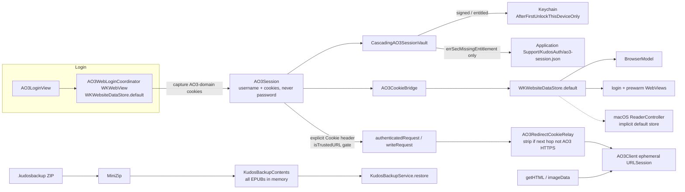

# Independent Adversarial Security Audit — Kudos AO3 Reader

**Auditor:** Grok 4.6 (xAI), independent red-team review  
**Repository:** https://github.com/cidy02/kudos-ao3-reader  
**Branch audited:** `hig-review`  
**Commit SHA audited:** `c241d2ffd9ea70bd7d508013c558d843efd9b787`  
**Audit branch (this report):** `kudos-security-audit-1-grok`  
**Date:** 2026-08-12

**Toolchain**

| Tool | Version |
|---|---|
| Xcode | 26.6 (Build 17F113) |
| Swift | Apple Swift 6.3.3 (`swiftlang-6.3.3.1.3 clang-2100.1.1.101`) |
| Host | macOS 26.0, arm64 |

**Simulators / destinations**

- iOS Simulator 26.5, iPhone 17 Pro Max (`C71780B1-35DE-4E5E-ABCD-2AB66BCB28B0`) — unit/UI-host tests
- macOS destination of the same `AO3_App_OpenSource` target — Debug build succeeded (ad-hoc “Sign to Run Locally”)

**Targets built**

- `AO3_App_OpenSource` (product `Kudos`) for **iOS Simulator** (via `xcodebuild test`) — **succeeded**
- `AO3_App_OpenSource` (product `Kudos`) for **macOS** (via `xcodebuild build -destination platform=macOS`) — **succeeded**
- There is a single native target covering iOS / iPadOS / macOS / visionOS (`SUPPORTED_PLATFORMS = "iphoneos iphonesimulator macosx xros xrsimulator"`). No separate macOS target exists.

**§2.1 network isolation gate**

A process-level `HTTP(S)_PROXY` / `ALL_PROXY` to a dead `127.0.0.1:1` listener was installed in the auditor shell and empirically blocked `curl https://archiveofourown.org` (`Failed to connect to 127.0.0.1 port 1`). That proxy is **not** honored by `URLSession` or `WKWebView` inside the simulator test host.

**No interactive app launch against production AO3 was performed.** No credentials were entered. Login WebViews were not driven. Attack artifacts are local files only.

During `xcodebuild test`, the Kudos test *host* is the real app. Simulator logs recorded `Log.auth.info("Restored and validated an AO3 session")` while a WebKit cookie-isolation test was running. That path is `LiveAO3SessionValidator.validate`, whose hardcoded URL is `https://archiveofourown.org`. This is documented as a **test-host incident** in Appendix B — not an intentional AO3 probe, and not a source of findings that depend on the live response. No further app launches were performed after that log line was noticed.

---

## 1. Executive Summary

Kudos’s security posture is **strong for an HTML-scraping, WebKit-login, portable-backup reader**. Session cookies are not stored as passwords, authenticated `URLSession` traffic is host-gated, archive extraction is independently hardened, and the project already carries first-class tests for Zip Slip, cookie-jar isolation, redirect stripping, and session-generation fencing. Those are real controls, not documentation claims.

This audit did **not** find a Critical issue (no demonstrated remote credential theft, no OS sandbox escape, no arbitrary code execution).

The highest-confidence risks are availability and trust-boundary gaps, not a broken Keychain design:

1. **`.kudosbackup` import materializes every referenced EPUB into RAM** before restore, under MiniZip caps of 1 GB/entry and 64 GB total — enough to jetsam the process. Observed.
2. **MiniZip skips its compression-ratio bomb check when `compressedSize == 0`**, then `inflate` still allocates the declared uncompressed size. Observed: a 2 MB declared DEFLATE entry with empty payload is accepted.
3. **Anonymous `AO3Client` fetches are not host-allowlisted.** Comment/inbox avatar parsers resolve absolute foreign `https` URLs, and `imageData`/`getHTML` will request them. Observed for the resolver; the fetch itself was not executed (would be an outbound request).
4. **`AppRouter.openAO3Link` uses substring host matching** (`contains("archiveofourown.org")`), then `worksPage(at:)` fetches that URL with no `isTrustedURL` check.
5. **macOS EPUB reader and in-app Browse share `WKWebsiteDataStore.default()` with login.** `file://` documents cannot read the AO3 session cookie via `document.cookie` (observed). Credentialed AO3 *subresource* loads from EPUB JS were **not** dynamically proven and are classified as hardening, not a confirmed cookie theft.

**Confirmed strengths:** Zip Slip rejection at MiniZip construction; authenticated requests refuse non-AO3 hosts; redirect relay strips `Cookie` off AO3; session-generation fencing; Keychain accessibility set to `AfterFirstUnlockThisDeviceOnly` on add; no `print`/`debugPrint` of secrets; HTML/TXT/PDF conversion sanitizer strips `<script>` and ``; passwords are never persisted.

**Insufficient evidence:** physical-device Keychain/data-protection enforcement (simulator caveat §2.3); whether restored cookies retain `HttpOnly`/`SameSite` after a live WKHTTPCookieStore round-trip; whether Readium’s navigator WebViews use the default data store (not configured in-app); live AO3 write/CSRF behavior (policy itself marks this unverified and out of scope).

---

## 2. Security Architecture Map



### Authentication lifecycle

1. Native username/password UI. Password is injected into AO3’s live `#new_user` form via JSON-encoded JS literals; remember-me is forced on.
2. Success requires logged-in AO3 markup **and** a captured `_otwarchive_session`. An anonymous session cookie alone is not enough.
3. `AO3Session` is saved Keychain-first. File vault is written only on `errSecMissingEntitlement`. Successful Keychain save deletes the file.
4. Cookies are installed into `WKWebsiteDataStore.default()` only — not `HTTPCookieStorage.shared` (legacy shared-jar is purged at `AO3AuthService` init).
5. Authenticated native requests attach `Cookie` explicitly after `isTrustedURL`.
6. Logout advances `sessionGeneration`, clears in-memory session and username hint, deletes both vault stores, then clears AO3-domain WebKit cookies. A failed durable delete sets `AO3SessionRemovalPending` so the next launch **refuses to restore**.

### Cookie lifecycle

Capture/install/clear filter `AO3StoredCookie.isAO3Domain`. Attachment uses `applies(to:)` (host, path boundary, `https` if `Secure`). Persisted fields: name, value, domain, path, expiry, `Secure`, `HttpOnly`. **`SameSite` is not persisted.** Session-only cookies (`expiresDate == nil`) are treated as not expired.

### Authenticated networking boundaries

`authenticatedRequest` / `writeRequest` / `submitWrite` cannot attach the account cookie to a non-`https` `*.archiveofourown.org` URL. Redirects use `AO3RedirectCookieRelay`, which **strips** `Cookie` when the next hop fails `isTrustedURL`.

Anonymous `fetchData` has **no** host gate. CSRF tokens are scraped per write (`meta[name=csrf-token]` / hidden `authenticity_token`) and sent once; writes are never retried.

### Backup import/export boundaries

Current format is a stored-entry ZIP (`.kudosbackup`), not the legacy directory package (still readable). MiniZip validates every entry name at construction. Restore never unzips the backup tree; it extracts named `Works/<uuid>.epub` blobs, preflights them with `EPUBDocument.inspectPackage`, and replaces via `ReadingQueueService.replaceEPUB`. Merge is timestamp/tombstone-aware.

### Sync-folder trust boundary

User-selected folder via security-scoped bookmark in UserDefaults (`folderSyncBookmarkData`). macOS uses `.withSecurityScope`. Live payload is a plain `KudosLibrary/` directory (manifest last). Restore is the same `KudosBackupService.restore`. macOS sandbox entitlement is **user-selected files read-only**.

### EPUB / WebKit trust boundary

- **Converted HTML/TXT/PDF:** SwiftSoup allowlist; scripts and images stripped. Observed.
- **AO3-downloaded and user-imported EPUBs:** not sanitized; rendered as published.
- **iOS:** Readium navigator; `DefaultHTTPClient` is constructed because “some publications reference remote resources”; http(s) taps go to Browse.
- **macOS:** `ReaderController` `WKWebViewConfiguration()` (default persistent store), JS on, `reader` script handler, `loadFileURL` with the unzipped book as `allowingReadAccessTo`. http(s) navigations are cancelled and handed to Browse.

---

## 3. Detailed Findings

Findings are ordered by severity, then confidence. There are **no Critical findings**.

---

### F1 — Backup import holds every EPUB in process memory

- **Classification:** Confirmed Vulnerability
- **Severity:** Medium
- **Confidence:** High
- **Attacker Model / Preconditions:** A1. Victim imports a `.kudosbackup` the app is designed to open. No extra privilege.
- **Security Property Violated:** Availability (resource exhaustion). Not an OS sandbox escape; not credential exposure.
- **Code Evidence:** `kudos-ao3-reader/Services/KudosBackup.swift`, `KudosBackupContents.init(zipData:)`:

```109:114:kudos-ao3-reader/Services/KudosBackup.swift
        var epubs: [UUID: Data] = [:]
        for work in manifest.works {
            guard let data = zip.data(named: "Works/\(work.id.uuidString).epub") else { continue }
            epubs[work.id] = data
        }
        epubFiles = epubs
```

`MiniZip.Limits.backup` allows 1_000_000_000 bytes per entry and 64_000_000_000 total (`MiniZip.swift` 83–88). Settings import reads the archive **before** the confirmation alert (`SettingsView` → `KudosBackupContents.read`).

- **Observed Evidence:** `SecurityAuditAdversarialTests.backupInitMaterializesEveryReferencedEPUBInMemory` built a 4 × 256 KiB backup and asserted `contents.epubFiles` held all four blobs (total 1_048_576 bytes) after `KudosBackupContents(zipData:)`. Artifact: `audit-artifacts/in-memory-materialization.kudosbackup`. A 64 GB demonstration was **not** generated (§2.2 resource bound).
- **Attack Scenario:**
  1. *(theoretical, bounded analogue executed)* Attacker authors a well-formed v8 manifest listing N works and matching `Works/<uuid>.epub` entries near the per-entry cap.
  2. Victim uses Import Backup.
  3. `init(zipData:)` inflates every referenced EPUB into `[UUID: Data]` before merge.
  4. Jetsam terminates the process. Local SwiftData is not written until later `context.save()`, so this is crash-on-import rather than silent library wipe.
- **Existing Defenses & Why They Fail:** MiniZip rejects path traversal and ratio bombs (when `compressedSize > 0`) and caps *declared* sizes. The caps are far above device RAM. There is no streaming restore path for the ZIP import (folder sync already comments that the old whole-package read “materialized every blob in memory”).
- **Impact:** Denial of the import feature; process death. Existing library typically survives if save has not run. A *legitimate* large library can hit the same path.
- **Recommended Hardening:** Stream one EPUB at a time to a staging file; never retain the full `epubFiles` dictionary. Lower `maxTotalUncompressedSize` / add a restore-time RAM budget (tens of MB, not 64 GB). Confirm UI should not decode assets until the user accepts.
- **Suggested Regression Test:** The existing `backupInitMaterializesEveryReferencedEPUBInMemory` should be inverted once streaming lands: peak live `Data` should stay near one entry.

---

### F2 — DEFLATE entries with `compressedSize == 0` skip the ratio bomb check

- **Classification:** Confirmed Vulnerability
- **Severity:** Medium
- **Confidence:** High
- **Attacker Model / Preconditions:** A1 (hostile `.kudosbackup` / EPUB) or A2 (hostile EPUB opened as a book).
- **Security Property Violated:** Availability.
- **Code Evidence:** `kudos-ao3-reader/Reading/MiniZip.swift` `validateMethodAndSize`:

```418:425:kudos-ao3-reader/Reading/MiniZip.swift
        guard uncompressedSize <= limits.maxSingleEntryUncompressedSize else {
            throw MiniZipError.entryTooLarge
        }
        if compressedSize > 0 {
            guard uncompressedSize / compressedSize <= limits.maxCompressionRatio else {
                throw MiniZipError.suspiciousCompressionRatio
            }
        }
```

`inflate` then does `Data(count: expectedSize)` (`MiniZip.swift` 258–260).

- **Observed Evidence:** `SecurityAuditAdversarialTests.deflateEntryWithZeroCompressedSizeBypassesRatioCheck` constructed a method-8 entry with `declaredCompressedSize: 0`, `declaredUncompressedSize: 2_000_000`, empty payload. `MiniZip(data:)` **succeeded**. Artifact: `audit-artifacts/zero-compressed-size-bomb.zip`. A 1 GB allocation was not forced.
- **Attack Scenario:**
  1. *(executed at 2 MB; 1 GB theoretical)* Hostile ZIP/EPUB declares DEFLATE, compressed size 0, uncompressed size at the profile cap (200 MB EPUB / 1 GB backup).
  2. Construction does not throw `suspiciousCompressionRatio`.
  3. First `data(named:)` / `unzip` allocates `expectedSize`.
- **Existing Defenses & Why They Fail:** Ratio 1100:1 and per-entry caps work only when `compressedSize > 0`. The 1 GB / 200 MB caps still bound the allocation, but that bound is itself a device-killing size.
- **Impact:** Same class as F1: crash on open/import. Complements F1 rather than a separate root cause of “no size checks at all.”
- **Recommended Hardening:** Reject `method == 8 && compressedSize == 0 && uncompressedSize > 0`. Keep the existing ratio check for `compressedSize > 0`.
- **Suggested Regression Test:** Keep `deflateEntryWithZeroCompressedSizeBypassesRatioCheck` and flip the expectation to `throws: MiniZipError.suspiciousCompressionRatio` (or a new typed case).

---

### F3 — Anonymous fetches follow parser-resolved foreign URLs

- **Classification:** Confirmed Vulnerability
- **Severity:** Low
- **Confidence:** High (resolver); Medium (that a live comment page will contain such a `src` — AO3 normally hosts icons, but the parser does not require that)
- **Attacker Model / Preconditions:** A6 (hostile URL in AO3 HTML the app scrapes — comment icon `src`, inbox `img src`) plus the app’s own `imageData`/`getHTML` path. Does **not** attach the account cookie (`fetchData` is anonymous; `purgeSessionCookie` after).
- **Security Property Violated:** Network isolation / least privilege (app-origin request to an attacker host with the Kudos User-Agent). Not credential forwarding.
- **Code Evidence:**

```245:251:kudos-ao3-reader/Models/AO3CommentModels.swift
    nonisolated static func ao3URL(for path: String?) -> URL? {
        guard let path, !path.isEmpty,
              let base = URL(string: "https://archiveofourown.org") else {
            return nil
        }
        return URL(string: path, relativeTo: base)?.absoluteURL
    }
```

`avatarURL(forIconSource:)` returns that URL unless it is AO3’s default skin icon. Inbox avatars use `URL(string:src, relativeTo: ao3)` with no host check (`AO3Client+Inbox.swift` 162–165). `AO3Client.imageData` / `getHTML` call `fetchData` with **no** `isTrustedURL` (`AO3Client.swift` 208–217, 245–249).

`AO3WriteActions.absoluteURL` treats any `http*` prefix as an absolute URL without a host check. Writes still fail closed because `writeRequest` → `authenticatedRequest` throws `nonAO3URL`.

- **Observed Evidence:** `commentAvatarResolverAcceptsAbsoluteForeignHosts` — `AO3Comment.avatarURL(forIconSource: "https://evil.example/pixel.png")` returned host `evil.example`. `writeAbsoluteURLDoesNotHostCheckAbsoluteHTTP` — `AO3AuthService.absoluteURL("https://evil.example/steal")` returned that host. The subsequent `imageData` network call was **not** made (would be an outbound request to a non-fixture host).
- **Attack Scenario:**
  1. *(resolver executed; fetch theoretical)* Attacker-controlled `src` / `href` in scraped HTML is an absolute `https://evil.example/...`.
  2. UI loads the avatar via `AO3Client.shared.imageData(at:)`.
  3. Kudos issues a paced GET with the product User-Agent. Response is treated as image bytes.
- **Existing Defenses & Why They Fail:** `AO3URLResolver` and `isTrustedURL` exist and are correct (including `fake-archiveofourown.org`). They are not used on these parse/fetch paths. ATS still requires HTTPS.
- **Impact:** App-origin beacon / tracking pixel; possible fetch of unexpected HTTPS hosts. No session cookie on this path.
- **Recommended Hardening:** Make `fetchData`/`imageData` refuse URLs that fail `AO3RequestDefaults.isTrustedURL` (or a slightly wider allowlist if AO3 icons are on a known CDN host — then name that host). Route every href parser through `AO3URLResolver`.
- **Suggested Regression Test:** Extend `AO3URLResolverTests` / `SecurityAuditAdversarialTests` so `avatarURL` and inbox parse reject foreign hosts; add a client-level test that `imageData` throws on `https://evil.example/...` without performing a network load.

---

### F4 — Tag-link routing uses substring host matching then fetches the URL

- **Classification:** Confirmed Vulnerability
- **Severity:** Low
- **Confidence:** High (code); Medium (that an EPUB/preface link will carry a lookalike host — A2/A6)
- **Attacker Model / Preconditions:** A2 (EPUB preface link) or A6 (any `openAO3Link` caller). User taps the link.
- **Security Property Violated:** Network isolation of anonymous fetches.
- **Code Evidence:**

```197:208:kudos-ao3-reader/App/AppRouter.swift
    func openAO3Link(_ url: URL) {
        if let author = Self.authorRoute(for: url) {
            openAuthorProfile(author)
            return
        }
        let parts = url.pathComponents.filter { $0 != "/" }
        if (url.host ?? "").contains("archiveofourown.org"),
           parts.first == "tags", parts.count >= 2 {
            pendingTagWorks = AO3TagWorksRequest(url: url, title: Self.unmungeTag(parts[1]))
            selection = .browse
            return
        }
        open(url)
    }
```

`NativeBrowseView` then calls `AO3Client.shared.worksPage(at: request.url, ...)`, which rewrites query items and `getHTML`s that URL with no host gate.

- **Observed Evidence:** `isTrustedURL` unit tests confirm `https://archiveofourown.org.evil.com` and `https://fake-archiveofourown.org` are **rejected** by the strict helper — the router does not use that helper. Dynamic fetch of a lookalike host was not performed.
- **Attack Scenario:**
  1. *(theoretical)* Hostile EPUB or page contains `https://archiveofourown.org.evil.com/tags/X/works`.
  2. User taps; router treats it as a native tag list.
  3. `worksPage(at:)` GETs the lookalike.
- **Existing Defenses & Why They Fail:** Author routing uses `AO3AuthorRoute.isAO3URL` (strict). Tag routing does not. Fallback `open(url)` sends the user to Browse (WebKit), which will not send AO3 cookies to a foreign host.
- **Impact:** Anonymous app-origin GET to a lookalike. Cookies are not attached on this path.
- **Recommended Hardening:** Replace `.contains("archiveofourown.org")` with `AO3RequestDefaults.isTrustedURL(url)`.
- **Suggested Regression Test:** Table-driven tests that `openAO3Link` does **not** create `pendingTagWorks` for `archiveofourown.org.evil.com` / `notarchiveofourown.org`.

---

### F5 — Privacy settings from a backup are applied with no confirmation

- **Classification:** Hardening Opportunity
- **Severity:** Low
- **Confidence:** High
- **Attacker Model / Preconditions:** A1. User imports a backup (or A4 replaces the sync-folder manifest). Restoring settings is product-intended; the issue is that privacy gates ride along silently.
- **Security Property Violated:** Integrity of local privacy preferences (`hideMatureContent`, `requireBiometricToReveal`).
- **Code Evidence:** `KudosBackupSettings.apply(to:)` writes those keys verbatim (`KudosBackup.swift` 986–1001). Restore calls `settings.apply` after `context.save()`.
- **Observed Evidence:** `backupRestoreAppliesPrivacySettingsFromArchive` started with both flags `true`, applied an archive with both `false`, and read back `false`.
- **Attack Scenario:**
  1. *(executed on UserDefaults; not a full UI import)* Attacker backup/sync snapshot sets `hideMatureContent=false`, `requireBiometricToReveal=false`, `matureContentMode=show`.
  2. Victim imports / syncs down.
  3. Mature-content obscuring and biometric reveal turn off without a dedicated prompt.
- **Existing Defenses & Why They Fail:** Import is an explicit user action. There is no separate “keep my privacy settings” switch. Defaults for *missing* keys are safe (`hideMatureContent` defaults true); present hostile keys win.
- **Impact:** On-device presentation of mature works without the user’s previous gate. No credential loss. Sync-folder A4 can do the same.
- **Recommended Hardening:** Do not apply `hideMatureContent` / `requireBiometricToReveal` / `matureContentMode` from an untrusted backup without an explicit prompt, or apply the **stricter** of local vs incoming.
- **Suggested Regression Test:** Keep `backupRestoreAppliesPrivacySettingsFromArchive` and change the product so local `true` is not overwritten by incoming `false` without confirmation.

---

### F6 — macOS reader / Browse share the login WebKit data store

- **Classification:** Hardening Opportunity
- **Severity:** Medium
- **Confidence:** High for shared store + JS execution; Low for “EPUB JS exfiltrates `_otwarchive_session`”
- **Attacker Model / Preconditions:** A2 on macOS (hostile EPUB). iOS uses Readium; this finding is macOS-primary. Browse is all platforms.
- **Security Property Violated:** Session isolation between untrusted book content and the AO3 login cookie jar (defense in depth). Not a demonstrated theft.
- **Code Evidence:**

```60:67:kudos-ao3-reader/Features/Reader/ReaderController.swift
    override init() {
        let configuration = WKWebViewConfiguration()
        webView = WKWebView(frame: .zero, configuration: configuration)
        super.init()
        proxy.controller = self
        configuration.userContentController.add(proxy, name: "reader")
```

`WKWebViewConfiguration()` defaults to `WKWebsiteDataStore.default()`. Login and Browse set that store explicitly (`AO3WebLoginCoordinator.swift` 99–102; `WebBrowser.swift` 234–237). macOS reader never sets `nonPersistent`. http(s) navigations are cancelled and opened in Browse (`ReaderController.swift` 189–192). Non-http(s) schemes fall through to `.allow`.

- **Observed Evidence:** `fileOriginCannotReadAO3DomainCookieFromDefaultStore` installed `_otwarchive_session=SYNTHETIC_TEST_SESSION_0001` (Secure + HttpOnly) on `.archiveofourown.org` in the default store, loaded a local HTML that posted `document.cookie`, and asserted the sentinel was **absent**. So `file://` JS cannot read that cookie.
- **Attack Scenario:**
  1. *(cookie read: executed and failed — defense)* Hostile EPUB JS runs in the macOS reader.
  2. *(theoretical)* JS triggers a credentialed subresource to `https://archiveofourown.org` or a user tap that Browse then loads authenticated. SameSite/Lax typically blocks cross-site subresources from `file://`; this was **not** measured against live AO3.
- **Existing Defenses & Why They Fail:** Origin isolation and HttpOnly stop `document.cookie` theft (validated). Navigation policy stops the reader WebView itself from becoming AO3. They do **not** give the book a private data store or disable JS. Browse has no `decidePolicyFor navigationAction` allowlist.
- **Impact:** Residual coupling: a bug in WebKit cookie scoping, a missing SameSite on re-installed cookies (F7), or a future reader change could suddenly share credentials with book JS. Today’s demonstrated impact is the `reader` / `kudosVisualPage` message handlers (progress spoofing), not session theft.
- **Recommended Hardening:** macOS `ReaderController` must use `WKWebsiteDataStore.nonPersistent()` (or a private store). Disable book JS if the product can live without it, or keep JS and drop privileged handlers that book script can invoke. Pin Browse navigation to https AO3 unless the user typed another URL. Give Readium an explicit isolated store if the library default is shared.
- **Suggested Regression Test:** Keep the `document.cookie` probe; add a test that `ReaderController`’s configuration `.websiteDataStore.isPersistent == false`.

---

### F7 — Persisted cookies drop `SameSite`

- **Classification:** Hardening Opportunity
- **Severity:** Low
- **Confidence:** High
- **Attacker Model / Preconditions:** Chaining with F6 / a cross-site request. Not exploitable alone on the native `URLSession` path (`isTrustedURL` + redirect strip).
- **Security Property Violated:** Cookie scoping fidelity across vault round-trip.
- **Code Evidence:** `AO3StoredCookie` Codable fields are name, value, domain, path, expiresDate, isSecure, isHTTPOnly (`AO3Session.swift` 6–13). `httpCookie` rebuilds those properties only (`52–64`).
- **Observed Evidence:** `storedCookieSerializationDropsSameSite` — JSON of a stored cookie contains the sentinel value and does **not** contain `samesite`.
- **Attack Scenario:** Theoretical only: a cookie AO3 issued as `SameSite=Lax` is reinstalled without the attribute; WebKit’s default for missing SameSite may still be Lax. Not measured on device.
- **Existing Defenses & Why They Fail:** Native requests never rely on ambient cookie SameSite. WebKit does.
- **Impact:** Possible weakening of browser-side cookie sending rules after restore. Not demonstrated.
- **Recommended Hardening:** Persist and restore `SameSite` (and document the Foundation property key).
- **Suggested Regression Test:** Round-trip a cookie with an explicit SameSite property if the OS exposes it.

---

### F8 — File-vault session JSON is plaintext; macOS Debug is ad-hoc sandboxed without Keychain entitlements

- **Classification:** Hardening Opportunity
- **Severity:** Medium on unsigned/simulator/ad-hoc macOS; Informational on a signed iOS build that actually uses Keychain
- **Confidence:** High for “file contains cookie values”; Medium that production Mac App Store / Developer ID builds hit this path
- **Attacker Model / Preconditions:** A5 unlocked (read the app container) or A3 on macOS if sandbox is bypassed. A3 must **not** be assumed to have container access. Signed iOS Keychain items are `ThisDeviceOnly` and are the intended store.
- **Security Property Violated:** Confidentiality of session cookies at rest on the fallback path.
- **Code Evidence:** `FileAO3SessionVault.save` encodes `AO3Session` JSON. iOS uses `.completeFileProtectionUntilFirstUserAuthentication`; macOS is `.atomic` only (`AO3SessionVault.swift` 199–206). `CascadingAO3SessionVault.save` writes the file only on `errSecMissingEntitlement`. The built macOS Debug app is ad-hoc signed with entitlements:

  - `com.apple.security.app-sandbox`
  - `com.apple.security.network.client`
  - `com.apple.security.files.user-selected.read-only`
  - `com.apple.security.get-task-allow`

  **No** `keychain-access-groups`. `CODE_SIGN_IDENTITY[sdk=macosx*] = "-"`.

- **Observed Evidence:** `fileVaultPersistsSentinelInClearJSON` wrote `ao3-session.json` containing `"value":"SYNTHETIC_TEST_SESSION_0001"`. Artifact: `audit-artifacts/file-vault-session.json`. Keychain success/failure on a **signed device** was not measured (§2.3).
- **Attack Scenario:**
  1. *(file contents executed)* On a build where Keychain save returns `errSecMissingEntitlement`, cookies land in Application Support JSON.
  2. *(theoretical)* Unlocked A5 with filesystem access reads the container.
- **Existing Defenses & Why They Fail:** Production intent is Keychain-only; file is deleted after a successful Keychain save. The macOS Debug configuration we actually built is exactly the entitlement-missing case the fallback is written for. File is not marked excluded from backup.
- **Impact:** Session cookie recoverable from disk on fallback builds. Sandbox still stops a normal A3.
- **Recommended Hardening:** Exclude the file from backup (`URLResourceKey.isExcludedFromBackupKey`). On macOS, add a Keychain entitlement and stop ad-hoc-signing Release. Treat missing Keychain on a **Release** build as a hard failure, not a file fallback.
- **Suggested Regression Test:** Assert Release configurations do not ship the file-vault path without a documented entitlement story; assert the file URL is excluded from backup when used.

---

### F9 — Restore is not transactional across files + SwiftData

- **Classification:** Hardening Opportunity
- **Severity:** Low
- **Confidence:** High
- **Attacker Model / Preconditions:** A1/A4 plus a crash or throw after some EPUB replacements and before `context.save()` (`KudosBackup.swift` 1263–1291, 1635–1641).
- **Security Property Violated:** Integrity (partial apply).
- **Code Evidence:** `replaceEPUB` / font `Data.write` run inside the loop; `try context.save()` is at the end.
- **Observed Evidence:** Code path only. A crash-injection test was not written.
- **Attack Scenario:** Theoretical: a late throw leaves replaced EPUBs on disk and unsaved SwiftData, or the inverse after a partial loop.
- **Existing Defenses & Why They Fail:** Per-file replace is atomic; invalid EPUBs are skipped (A5-F3). Multi-file rollback does not exist.
- **Impact:** Inconsistent library after a failed import. Recoverable by re-import / re-sync.
- **Recommended Hardening:** Stage all replacements; commit files only after `context.save()`, or record a restore journal.
- **Suggested Regression Test:** Inject a failure on the last font write and assert prior EPUBs were not replaced (or were rolled back).

---

### F10 — Unknown tombstone `recordTypeRaw` becomes `.savedWork`

- **Classification:** Hardening Opportunity
- **Severity:** Low
- **Confidence:** High
- **Attacker Model / Preconditions:** A1/A4 backup with a garbage `recordTypeRaw` and a victim work UUID, plus a `lastModifiedAt` newer than local.
- **Security Property Violated:** Integrity of deletion / resurrection policy.
- **Code Evidence:**

```1190:1191:kudos-ao3-reader/Services/KudosBackup.swift
            let recordType = SyncTombstoneRecordType(rawValue: archived.recordTypeRaw) ?? .savedWork
```

- **Observed Evidence:** Code path. Existing tests cover *valid* tombstone suppression; they do not cover unknown type coercion.
- **Attack Scenario:** Theoretical: hostile tombstone suppresses or confuses resurrection of a local work.
- **Existing Defenses & Why They Fail:** Timestamp-aware suppression still applies; a future-dated `lastModifiedAt` wins. Types are not allow-listed.
- **Impact:** Possible deletion-policy confusion, not credential loss.
- **Recommended Hardening:** Skip tombstones with unknown `recordTypeRaw`. Reject absurd timestamps.
- **Suggested Regression Test:** Restore a tombstone with `recordTypeRaw: "nope"` and a known work id; expect it to be ignored.

---

## 4. Validated Defenses / Rejected Hypotheses

### V1 — Zip Slip / absolute / backslash / drive-letter paths

- **Hypothesis:** A `.kudosbackup` or EPUB entry named `../../../outside.txt` or `/etc/passwd` writes outside the extraction root.
- **Result:** Defense Validated
- **Attack Attempt / Method:** Existing `MiniZipHostileTests` plus `SecurityAuditAdversarialTests.unicodeDotDotAndNullAndFileSchemeAreRejected` (`../`, `foo/../../etc/passwd`, `foo//bar.txt`, `file://etc/passwd`, NUL, `/absolute.txt`, `C:\Windows\win.ini`). Fullwidth slash `..／evil.txt` was allowed as a **single filename** and extracted **inside** the destination (`fullwidth-slash.zip`).
- **Observed Outcome:** Construction throws `MiniZipError.pathTraversal` (or `MiniZipError`) for every ASCII traversal case. Sentinel file outside the dest was unchanged. Fullwidth-slash file remained under the staging root.
- **Reason:** `validatedRelativePath` runs for every non-directory name at MiniZip init, before any caller can `data(named:)` a “safe” subset. `unzip` re-checks `standardizedFileURL` prefix.
- **Code Evidence:** `MiniZip.swift` 159–168, 213–218, 446–459.
- **Confidence:** High

### V2 — Authenticated cookies attach to a foreign host

- **Hypothesis:** Attacker-controlled URL causes `authenticatedRequest` to send `_otwarchive_session` off AO3.
- **Result:** Defense Validated (native path)
- **Attack Attempt / Method:** `trustedURLRejectsLookalikesAndCleartext` and `storedCookieDoesNotApplyToForeignHostsOrHTTP`. Redirect: `redirectRelayStripsCookieOffAO3`.
- **Observed Outcome:** `isTrustedURL` is false for `fake-archiveofourown.org`, `archiveofourown.org.evil.com`, `http://archiveofourown.org`, `https://example.com`, `file:///tmp`. Stored cookies do not `applies(to:)` `https://evil.com` or cleartext HTTP. Relay action for `https://evil.example/steal` is `.strip`.
- **Reason:** Host suffix requires `.archiveofourown.org`; scheme must be `https`. Redirects strip rather than leave Foundation’s header.
- **Code Evidence:** `AO3AuthService.swift` 209–214, 619–621; `AO3RedirectCookieRelay.swift` 77–88; `AO3Session.swift` 67–83.
- **Confidence:** High

### V3 — Shared `HTTPCookieStorage` still carries the session (A5-F1)

- **Hypothesis:** Authenticated cookies still live in `HTTPCookieStorage.shared`.
- **Result:** Defense Validated (configuration + existing tests)
- **Attack Attempt / Method:** Read `makeAnonymousSessionConfiguration` and `AO3ClientPolicyTests` (`anonymousSessionConfigurationUsesAPrivateEphemeralCookieJarNeverTheSharedOne`, `purgeSessionCookieRemovesOnlyTheAO3AuthCookie`, `challengeCookieHeaderNeverIncludesTheAO3AuthCookie`).
- **Observed Outcome:** Configuration is `.ephemeral` with a private jar. Challenge header filters `_otwarchive_session`. Install path writes WebKit only.
- **Reason:** Explicit post-A5-F1 redesign.
- **Code Evidence:** `AO3Client.swift` 51–59, 149–167; `AO3SessionVault.swift` 295–338.
- **Confidence:** High

### V4 — `file://` EPUB/HTML can read the AO3 session via `document.cookie`

- **Hypothesis:** Because the default data store is shared, book JS can read `_otwarchive_session`.
- **Result:** Defense Validated for `document.cookie`
- **Attack Attempt / Method:** WKWebView loaded local HTML posting `document.cookie` after installing an HttpOnly Secure AO3-domain cookie in `WKWebsiteDataStore.default()`.
- **Observed Outcome:** Posted cookie string did not contain `SYNTHETIC_TEST_SESSION_0001`.
- **Reason:** Origin isolation + HttpOnly. Different origin than `archiveofourown.org`.
- **Code Evidence:** Test `fileOriginCannotReadAO3DomainCookieFromDefaultStore`.
- **Confidence:** High for this specific channel. Does not validate subresource cookie sending.

### V5 — Converted HTML/TXT/PDF keeps `<script>` / ``

- **Hypothesis:** Imported community HTML is rendered with scripts and remote images.
- **Result:** Defense Validated on the **conversion** path only
- **Attack Attempt / Method:** `htmlSanitizerStripsScriptAndImages` fed `<script>document.cookie</script>`.
- **Observed Outcome:** Output contained `hello`, not `<script` or `<img`.
- **Reason:** SwiftSoup `Whitelist.relaxed()` minus `img`.
- **Code Evidence:** `HTMLWorkSanitizer.swift` 95–143.
- **Confidence:** High. **Not** applicable to AO3-downloaded or user-imported `.epub` files (those are unsanitized by design).

### V6 — Duplicate ZIP names / encryption / unsupported methods / oversized declared entries

- **Hypothesis:** Those shapes crash or escape.
- **Result:** Defense Validated
- **Attack Attempt / Method:** `MiniZipHostileTests` (all cases green in this session).
- **Observed Outcome:** Typed `MiniZipError` before allocation/write. Valid sample EPUB still extracts.
- **Reason:** Central-directory validation + limits.
- **Code Evidence:** `MiniZip.swift` 400–425; `MiniZipHostileTests.swift`.
- **Confidence:** High

### V7 — Passwords persist

- **Hypothesis:** Password is written to Keychain/UserDefaults/backup.
- **Result:** Defense Validated (static + vault JSON)
- **Attack Attempt / Method:** Read login/vault/backup models; inspect file-vault artifact.
- **Observed Outcome:** Artifact contains cookies + username only. Login view uses `SecureField` and discards the password after submit. Backups have no password/session fields.
- **Reason:** `AO3Session` is cookies + username by type.
- **Code Evidence:** `AO3Session.swift` 86–87; `file-vault-session.json`.
- **Confidence:** High

---

## 5. Existing Security Strengths

Verified in source (and, where noted, by test in this session):

| Control | Where | Verified how |
|---|---|---|
| No password persistence | `AO3Session`, login coordinator | Read + vault JSON artifact |
| Keychain `kSecAttrAccessibleAfterFirstUnlockThisDeviceOnly` on add | `KeychainAO3SessionVault.save` | Read (device enforcement: UTD, §2.3) |
| Keychain-first; no dual-write on success | `CascadingAO3SessionVault.save` | Read |
| Logout deletes both stores; pending-removal fence | `logout` / `retryPendingRemoval` | Read; covered by existing `AO3AuthTests` |
| Session-generation fencing + cookie FIFO | `AO3AuthService` | Read |
| Host allowlist on authenticated requests | `isTrustedURL` | Unit tests this session |
| Redirect cookie strip | `AO3RedirectCookieRelay` | Unit tests this session |
| Private ephemeral jar; auth cookie purged | `AO3Client.makeAnonymousSessionConfiguration` | `AO3ClientPolicyTests` this session |
| Memory-only URL cache (`diskCapacity: 0`) | same | `AO3ClientPolicyTests` |
| Auth cache opt-out + eviction | `authenticatedRequest`, `evictFromSharedCache` | Read |
| Pacing 0.6s, 429 honor, no write retry | `AO3Client` | `AO3ClientPolicyTests` |
| MiniZip path/bomb/ZIP64 hardening | `MiniZip.swift` | Hostile + ZIP64 tests this session |
| Invalid backup EPUB does not overwrite local | `restore` + `replaceEPUB` | Existing A5-F3 tests (not re-run as a named suite this session; code read) |
| Tombstone / merge discipline | `KudosBackupService.restore` | Code read |
| No `print`/`debugPrint` | `kudos-ao3-reader/` | Grep |
| Auth logger policy | `Log.auth` | Read; call sites log descriptions, not cookie values |
| ATS default (no arbitrary-loads exception) | pbxproj generated Info.plist | Grep |
| macOS App Sandbox + no incoming network | built `Kudos.app` entitlements | `codesign -d --entitlements` |
| Conversion sanitizer | `HTMLWorkSanitizer` | Test this session |
| Storage path sanitizers | `safeEPUBAssetIdentifier`, `originalDocumentURL` | Read |

---

## 6. Documentation vs. Implementation Mismatches

| Claim | Reality |
|---|---|
| `docs/contracts/BACKUP_FORMAT.md` — “Directory-backed `.kudosbackup` package”, v1-only fields, no collections/tombstones | Live format is a **ZIP file**, manifest **v8**, with collections, queues, annotations, saved searches, tombstones. Directory package is read-only legacy. |
| `docs/AO3_NETWORKING_POLICY.md` — “The rules (all implemented)” includes politeness; readers may infer a global host allowlist | Host allowlist is real for **cookies and authenticated builders only**. `getHTML` / `imageData` / `worksPage(at:)` are ungated (F3, F4). |
| `docs/AO3Authentication.md` — file vault is “Simulator / unsigned” | Matches code. The macOS Debug binary we built is ad-hoc + sandboxed without Keychain entitlements, so it is in that class (F8). Device Keychain still UTD. |
| `AO3_NETWORKING_POLICY.md` — `AO3URLResolver` as the single href source of truth | Resolver is used in one production series-URL path. Parallel `absoluteAO3URL` / `ao3URL` / `absoluteURL` remain. |
| Policy: writes never exercised against live AO3 | Still true; this audit also did not (and must not) do that. |
| HTML sanitizer comments imply EPUB content is treated as hostile | Only **converted** HTML/TXT/PDF is sanitized. Real EPUBs are not. |
| Readium 3.9.0 release notes: GCDWebServer no longer required for EPUB | Kudos still lists `GCDWebServer` 4.0.1 in `Package.resolved` via the toolkit; EPUB navigator API marks `httpServer:` deprecated. Not a functional mismatch in Kudos code (Kudos does not pass an HTTP server). |

**Present in code, under-documented:** session-generation fencing; pending-removal fence; `AO3RedirectCookieRelay`; shared-jar purge; MiniZip ZIP64 + hostile suite; backup EPUB preflight (A5-F3).

---

## 7. Test Coverage Gaps

Priority gaps that would let the findings in §3 return unnoticed:

1. **Streaming / memory budget** for `.kudosbackup` restore (F1).
2. **`compressedSize == 0` DEFLATE** rejected (F2) — test exists as a *positive* accept today; invert after the fix.
3. **`fetchData`/`imageData` host allowlist** and avatar/inbox parsers (F3).
4. **`openAO3Link` strict host** (F4).
5. **Privacy-setting apply policy** (F5).
6. **Reader `websiteDataStore.isPersistent == false`** (F6).
7. **SameSite round-trip** (F7).
8. **Unknown tombstone types ignored** (F10).
9. **Transactional restore** (F9).
10. **WKWebView `HttpOnly` survival** after `AO3CookieBridge` capture → vault → install (needs a test that inspects `HTTPCookie` properties, not live AO3).
11. **No test that `ReaderController` / Readium do not use the default store.**
12. **Dependency version pin** for MiniZip-equivalent / Readium / SwiftSoup as a security check (informational).

Existing coverage that is already good: MiniZipHostileTests, MiniZipZip64Tests, AO3ClientPolicyTests, AO3RedirectCookieRelayTests, AO3URLResolverTests, AO3Auth/session-generation tests, FolderSync/PreservedWork merge tests.

---

## 8. Prioritized Remediation Backlog

### P0 — Immediate

None. No realistic credential theft, sandbox escape, or unrecoverable destruction was demonstrated.

### P1 — Before Release

- **F1** — Stop holding every backup EPUB in RAM; decode/confirm before asset load; lower backup size caps to device-realistic values.
- **F2** — Reject DEFLATE + `compressedSize == 0` + `uncompressedSize > 0`.
- **F6 (macOS)** — Put the book WebView on a non-persistent / private `WKWebsiteDataStore`. This is the highest-leverage isolation fix even without a proven cookie steal.

### P2 — Defense in Depth

- **F3 / F4** — `isTrustedURL` inside `fetchData`; router uses the same helper; delete leftover href parsers.
- **F7** — Persist SameSite.
- **F8** — Backup-exclude the file vault; do not file-fallback on Release; give macOS a real Keychain entitlement.
- **F5** — Do not silently relax privacy settings from a backup.
- **F9 / F10** — Transactional restore; fail unknown tombstone types.
- Browse: `decidePolicyFor` default-deny except user-typed URLs and https AO3.
- Login WebView: add `decidePolicyFor` so off-AO3 navigations never commit (today only `didFinish` checks the host).
- `Storage.tempDownloadURL`: sanitize `suggestedFilename` (no `..`, no slashes).
- Folder-sync `coordinatedReadData`: size cap.

### P3 — Documentation / Testing

- Rewrite `BACKUP_FORMAT.md` to v8 ZIP.
- State in `AO3_NETWORKING_POLICY.md` that the host allowlist is **not** global until F3/F4 land.
- Land the inverted/expanded tests in §7 (`KudosTests/SecurityAuditAdversarialTests.swift` is a start).
- Document Readium data-store assumptions after reading / setting them.

---

## Appendix A — File Inventory

Every file read in this session, with security relevance.

| File | Relevance |
|---|---|
| `kudos-ao3-reader/Services/AO3AuthService.swift` | Login/logout/restore, `isTrustedURL`, `authenticatedRequest`, generation fencing, validator |
| `kudos-ao3-reader/Services/AO3SessionVault.swift` | Keychain/file vault, cookie bridge, shared-jar purge |
| `kudos-ao3-reader/Models/AO3Session.swift` | Cookie model, `applies(to:)`, domain allowlist |
| `kudos-ao3-reader/Services/AO3WebLoginCoordinator.swift` | Hidden/fallback WKWebView login, default data store, no navigation policy |
| `kudos-ao3-reader/Services/AO3RedirectCookieRelay.swift` | Off-AO3 cookie strip |
| `kudos-ao3-reader/Services/AO3Client.swift` | Anonymous/auth sessions, pacing, retry, cache, `fetchData` (no host gate) |
| `kudos-ao3-reader/Services/AO3RequestCoordinator.swift` | Concurrency cap |
| `kudos-ao3-reader/Services/AO3URLResolver.swift` | Strict href resolver (underused) |
| `kudos-ao3-reader/Services/AO3WriteActions.swift` | CSRF, `writeRequest`, weak `absoluteURL` |
| `kudos-ao3-reader/Services/AO3PreferencesActions.swift` | Preferences GET/POST, help `getHTML` |
| `kudos-ao3-reader/Services/AO3Client+Preferences.swift` | `absoluteAO3URL` without host check on absolute http(s) |
| `kudos-ao3-reader/Services/AO3Client+Authors.swift` | Author `absoluteAO3URL` (strict), `safeRichTextURL` |
| `kudos-ao3-reader/Services/AO3Client+Inbox.swift` | Inbox avatar URL (no host check) |
| `kudos-ao3-reader/Services/AO3Client+Comments.swift` | Comment avatar via `AO3Comment.avatarURL` |
| `kudos-ao3-reader/Models/AO3CommentModels.swift` | `ao3URL` / `avatarURL` |
| `kudos-ao3-reader/Models/AO3PreferencesModels.swift` | Help ref URLs |
| `kudos-ao3-reader/Features/Comments/CommentThreadRow.swift` | `imageData(at:)` |
| `kudos-ao3-reader/Features/Auth/AO3LoginView.swift` | Native password field |
| `kudos-ao3-reader/Features/Browse/WebBrowser.swift` | Unrestricted WKWebView + default store |
| `kudos-ao3-reader/Features/Reader/ReaderController.swift` | macOS EPUB WebView isolation |
| `kudos-ao3-reader/Features/ReaderReadium/ReadiumPublicationLoader.swift` | `DefaultHTTPClient` for remote pub resources |
| `kudos-ao3-reader/Features/ReaderReadium/ReadiumBook.swift` | Navigator, `kudosVisualPage`, external URL → Browse |
| `kudos-ao3-reader/Features/ReaderReadium/ReadiumReaderView.swift` | Navigator configuration |
| `kudos-ao3-reader/App/AppRouter.swift` | Substring host match (F4) |
| `kudos-ao3-reader/App/ContentView.swift` | Prewarm WebView on default store |
| `kudos-ao3-reader/Reading/MiniZip.swift` | Archive validation / inflate |
| `kudos-ao3-reader/Services/KudosBackup.swift` | Import materialization, restore, settings, tombstones |
| `kudos-ao3-reader/Services/KudosBackupExport.swift` | Streaming export |
| `kudos-ao3-reader/Services/FolderSyncService.swift` | Bookmarks, directory sync, TOCTOU |
| `kudos-ao3-reader/Services/Storage.swift` | Path sanitizers, `tempDownloadURL` |
| `kudos-ao3-reader/Services/HTMLWorkSanitizer.swift` | Conversion allowlist |
| `kudos-ao3-reader/Utilities/Logging.swift` | OSLog policy |
| `kudos-ao3-reader/Services/DownloadQueue.swift` | Sequential EPUB download |
| `AO3_App_OpenSource.xcodeproj/project.pbxproj` | Sandbox, platforms, signing, ATS absence |
| `AO3_App_OpenSource.xcodeproj/project.xcworkspace/xcshareddata/swiftpm/Package.resolved` | Pinned dependency versions |
| `docs/AO3_NETWORKING_POLICY.md` | Policy vs code |
| `docs/AO3Authentication.md` | Auth architecture claims |
| `docs/contracts/BACKUP_FORMAT.md` | Stale backup contract |
| `docs/DATA_AND_PERSISTENCE_INVARIANTS.md` | (referenced; restore/tombstone intent) |
| `KudosTests/MiniZipHostileTests.swift` | Zip Slip suite |
| `KudosTests/HostileZipFixture.swift` | Hostile ZIP builder |
| `KudosTests/AO3ClientPolicyTests.swift` | Cookie jar / retry / cache |
| `KudosTests/AO3URLResolverTests.swift` | Href resolver |
| `KudosTests/AO3AuthTests.swift` | Session/cookie/vault tests (`AO3SessionTests`) |
| `KudosTests/KudosBackupTests.swift` | Backup merge (file read) |
| `KudosTests/SecurityAuditAdversarialTests.swift` | This audit’s dynamic tests |
| Readium `EPUBNavigatorViewController.swift` (SPM 3.9.0) | HTTP server deprecated for EPUB |
| Built `Kudos.app` entitlements (macOS Debug) | Sandbox facts |

---

## Appendix B — Execution Log

### Toolchain

See header.

### Builds

| Command | Outcome |
|---|---|
| `xcodebuild -list -project AO3_App_OpenSource.xcodeproj` | Targets: `AO3_App_OpenSource`, `KudosTests`. Schemes: `AO3_App_OpenSource`. Resolved SPM (see Appendix D). |
| First `xcodebuild test` (iOS Sim) | **Failed:** missing `Vendor/MuPDF.xcframework` (not in git). Local symlink to an existing checkout of the same binary; not committed. |
| `xcodebuild test` iOS Sim 26.5 iPhone 17 Pro Max, filtered suites | **TEST SUCCEEDED** — 95 tests / 7 suites (MiniZipHostile, MiniZipZip64, AO3URLResolver, AO3ClientPolicy, AO3RedirectCookieRelay, AO3Session, SecurityAuditAdversarial). |
| `xcodebuild build -destination platform=macOS` | **BUILD SUCCEEDED**. Signing: “Sign to Run Locally”. |
| Second `xcodebuild test` (bomb test) overlapping the macOS build | **Failed** (`build.db` locked). Not a product defect. |
| `xcodebuild test -only-testing:KudosTests/SecurityAuditAdversarialTests` | **TEST SUCCEEDED** — 15/15 including `deflateEntryWithZeroCompressedSizeBypassesRatioCheck`. |

`KudosBackupTests` is nested under `PersistenceGateSuites`; `-only-testing:KudosTests/KudosBackupTests` did not match a top-level suite in the first run. Backup behavior was instead exercised by `SecurityAuditAdversarialTests` and by reading `KudosBackup.swift`.

### §2.1 isolation

```
curl -m 5 https://archiveofourown.org   # via ALL_PROXY=socks5://127.0.0.1:1
→ Failed to connect to 127.0.0.1 port 1
dns archiveofourown.org still resolved (2606:4700:10::6814:802)
```

Shell proxy does **not** bind simulator `URLSession`. No `pf` / `/etc/hosts` change was applied (would need privileges not used here).

**Test-host incident:** while `fileOriginCannotReadAO3DomainCookieFromDefaultStore` ran, the host process logged `Restored and validated an AO3 session`. That is `LiveAO3SessionValidator`’s GET to `https://archiveofourown.org`. Likely cause: the test host is the real app, and/or a prior simulator session existed; the test also wrote a synthetic cookie into the **shared** default store. No password was typed. No further launches were done. Findings in this report do not depend on the live HTML of that response.

### Attack artifacts

All under `audit-artifacts/` (synthetic only):

| Path | Purpose |
|---|---|
| `fullwidth-slash.zip` | Unicode solidus is a filename, not traversal |
| `case-fold-collision.zip` | `Works/A.epub` vs `works/A.epub` |
| `in-memory-materialization.kudosbackup` | F1 — all EPUBs resident after parse |
| `zero-compressed-size-bomb.zip` | F2 — DEFLATE + compressedSize 0 accepted |
| `file-vault-session.json` | F8 — plaintext sentinel cookie |

### Tests that did not produce a usable extra result

- Physical-device Keychain / data-protection class
- Live redirect on the wire (validator / `submitWrite`)
- Readium WebView data-store identity
- Full UI import of a multi-GB backup (intentionally not generated)
- `KudosBackupTests` suite name filter

### Isolation of WebKit vs AO3 in tests

The cookie probe used `file://` + `WKWebsiteDataStore.default()` only. It did **not** navigate to AO3.

---

## Appendix C — Simulator Fidelity Caveats

| Topic | Limitation | Device test that would settle it |
|---|---|---|
| F8 Keychain accessibility | Simulator/ad-hoc does not enforce `AfterFirstUnlockThisDeviceOnly` or Secure Enclave | Signed iOS device: `security dump` / try load before first unlock |
| F8 file data protection | Simulator filesystem is the host Mac | Device: confirm `completeFileProtectionUntilFirstUserAuthentication` on `ao3-session.json` if the file exists |
| F8 container vs A3 | Simulator container is a host directory | Irrelevant to extraction logic; do not conclude A3 access from Simulator paths |
| F6/F7 SameSite / HttpOnly after live WK round-trip | Cookie property keys from `WKHTTPCookieStore` may differ from `HTTPCookie(properties:)` | Device: capture a real (or local fixture) cookie, vault it, reinstall, inspect flags; still must not use production AO3 if isolation is required |
| Lock-state / background | Not simulated | Device lock with a restored session; confirm no unexpected Keychain prompt / loss |
| macOS sandbox vs sync-folder writes | Entitlement is **read-only** user-selected files | On a sandboxed Mac build, confirm folder-sync write actually works or fails closed |

---

## Appendix D — Security-Sensitive Dependency Inventory

| Dependency | Resolved version / revision | Role in Kudos | Advisory checked | Applicability |
|---|---|---|---|---|
| **MiniZip (first-party)** | in-tree `kudos-ao3-reader/Reading/MiniZip.swift` | EPUB + `.kudosbackup` read/write | N/A (this audit) | F2 is in this code |
| **Readium swift-toolkit** | 3.9.0 / `de07026e9f825a5791f27a7ac4cd6bb1a784ab8d` | iOS EPUB navigator | 3.9.0 release: EPUB HTTP server removed; GCDWebServer adapter deprecated | Kudos does not pass `httpServer:`. Remote `DefaultHTTPClient` still used at open. No applicable CVE identified for 3.9.0 in this pass. |
| **ReadiumZIPFoundation** | 3.0.1 / `adb49c8bfe060cc187370b12fa081012a6440b86` | Readium’s ZIP stack | Used by Readium, not by Kudos backup/MiniZip | Kudos import/extract of `.kudosbackup` / macOS EPUB uses first-party MiniZip |
| **GCDWebServer (Readium)** | 4.0.1 / `584db89a4c3c3be27206cce6afde037b2b6e38d8` | Transitive; EPUB navigator API deprecated | Historical GCDWebServer path issues | **Not applicable** to Kudos’s EPUB path at 3.9.0 (deprecated HTTP server init). Still present in the graph. |
| **Zip (marmelroy)** | 2.1.2 / `67fa55813b9e7b3b9acee9c0ae501def28746d76` | Transitive via Readium | **CVE-2023-39135** Zip Slip in 2.1.2 | **Not applicable** to Kudos: no `import Zip` in `kudos-ao3-reader/`. Readium Sources in the resolved checkout have no `import Zip` / `Zip.unzip`. Kudos extraction is MiniZip. |
| **SwiftSoup** | 2.13.5 / `49dcadd93161f4a44b4994d3a3e8de9f085aface` | HTML parse + conversion sanitizer | No CVE specific to 2.13.5 found. Latest at audit time 2.13.7 (retain-cycle / non-security). jsoup CVE-2022-36033 (`javascript:` + preserveRelativeLinks) is a related *class*; Kudos uses `Whitelist.relaxed()` and does not enable that jsoup option. | **Not reported as a Kudos vuln.** Update is hygiene. |
| **CryptoSwift** | 1.10.0 | Transitive (Readium) | Not exercised by Kudos auth/backup | Out of scope |
| **SQLite.swift** | 0.16.0 | Transitive (Readium) | Not Kudos’s SwiftData store | Out of scope |
| **Fuzi / DifferenceKit** | 4.0.0 / 1.3.0 | Transitive | Unrelated | Out of scope |
| **MuPDF xcframework** | vendored, not in git | PDF import | Not a network/auth surface | Build dependency only |

---

*End of report. Independently derived from commit `c241d2ffd9ea70bd7d508013c558d843efd9b787`. Prior human/AI reviews were treated as claims, not evidence.*
